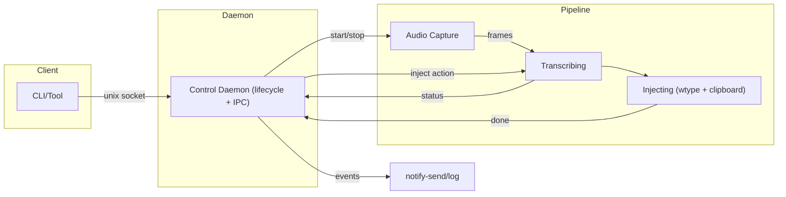
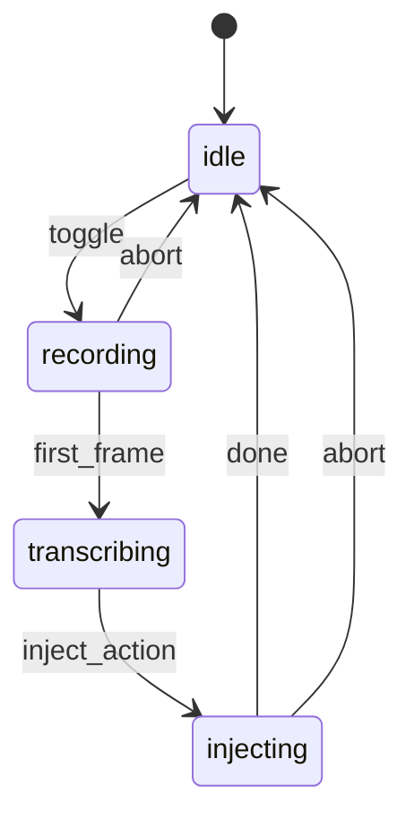

# Hyprvoice - Voice-Powered Typing for Hyprland / Wayland

Press a toggle key, speak, and get instant text input. Built natively for Wayland/Hyprland - no X11 hacks or workarounds, just clean integration with modern Linux desktops.

## Features

- **Toggle workflow**: Press once to start recording, press again to stop and inject text
- **Wayland native**: Purpose-built for Wayland compositors - no legacy X11 dependencies or hacky workarounds
- **Real-time feedback**: Desktop notifications for recording states and transcription status
- **Multiple transcription backends**: OpenAI Whisper and Groq (planned: whisper.cpp for local processing, gemini, and more)
- **LLM post-processing**: Optional AI cleanup to remove filler words, fix punctuation, and improve clarity
- **Smart text injection**: Clipboard save/restore with direct typing fallback
- **Daemon architecture**: Lightweight control plane with efficient pipeline management

**Status:** Beta - core functionality complete and tested, ready for early adopters

## Installation

### From AUR (Arch Linux) - Recommended

```bash
# Install hyprvoice and all dependencies automatically
yay -S hyprvoice-bin
# or
paru -S hyprvoice-bin
```

The AUR package automatically installs all dependencies (`pipewire`, `wl-clipboard`, `wtype`, etc.) and sets up the systemd service. Follow the post-install instructions to complete setup.

### Alternative: Download Binary

For non-Arch users or testing:

```bash
# Download and install binary
wget https://github.com/leonardotrapani/hyprvoice/releases/latest/download/hyprvoice-linux-x86_64
mkdir -p ~/.local/bin
mv hyprvoice-linux-x86_64 ~/.local/bin/hyprvoice
chmod +x ~/.local/bin/hyprvoice

# Add to PATH (add to ~/.bashrc or ~/.zshrc)
export PATH="$HOME/.local/bin:$PATH"

# You'll need to manually install dependencies and create systemd service
# See Requirements section above
```

### Build from Source

```bash
git clone https://github.com/leonardotrapani/hyprvoice.git
cd hyprvoice
go mod download
go build -o hyprvoice ./cmd/hyprvoice

# Install locally
mkdir -p ~/.local/bin
cp hyprvoice ~/.local/bin/
export PATH="$HOME/.local/bin:$PATH"
```

## Requirements

- **Wayland desktop** (Hyprland, Niri, GNOME, KDE, etc.)
- **PipeWire audio system** with tools
- **API key for transcription**: OpenAI API key or Groq API key (Groq offers faster processing and free tier)

**System packages** (automatically installed with AUR package):

- `pipewire`, `pipewire-pulse`, `pipewire-audio` - Audio capture
- `wl-clipboard` - Clipboard integration
- `wtype` - Text typing (Wayland)
- `ydotool` - Text typing (universal, recommended for Chromium apps)
- `libnotify` - Desktop notifications
- `systemd` - User service management

For manual installation on other distros:

```bash
# Ubuntu/Debian
sudo apt install pipewire-pulse pipewire-bin wl-clipboard wtype ydotool libnotify-bin

# Fedora
sudo dnf install pipewire-utils wl-clipboard wtype ydotool libnotify

# For ydotool, you also need to start the daemon:
systemctl --user enable --now ydotool
# Or add user to input group for uinput access:
sudo usermod -aG input $USER
```

## Quick Start

After installing via AUR:

1. **Configure hyprvoice interactively:**
```bash
hyprvoice configure
```
This wizard will guide you through setting up your OpenAI API key, audio preferences, and other settings.

2. **Enable and start the service:**
```bash
systemctl --user enable --now hyprvoice.service
```

3. **Add keybinding to your window manager:**
```bash
# For Hyprland, add to ~/.config/hypr/hyprland.conf
bind = SUPER, R, exec, hyprvoice toggle
```

4. **Test voice input:**

```bash
# Check daemon status
hyprvoice status

# Toggle recording (or use your keybind)
hyprvoice toggle
# Speak something...
hyprvoice toggle  # Stop and transcribe
```

## Quick Reference

### Common Commands

```bash
# Interactive configuration wizard
hyprvoice configure

# Start the daemon
hyprvoice serve

# Toggle recording on/off
hyprvoice toggle

# Cancel current operation
hyprvoice cancel

# Check current status
hyprvoice status

# Get or set processing mode (raw transcription or LLM cleanup)
hyprvoice mode          # Show current mode
hyprvoice mode raw      # Direct transcription
hyprvoice mode llm      # AI-cleaned transcription

# Print application version
hyprvoice version

# Stop the daemon (if not using systemd service)
hyprvoice stop
```

### Keybinding Pattern

Most setups use this toggle pattern in window manager config:

```bash
bind = SUPER, R, exec, hyprvoice toggle
bind = SUPER SHIFT, R, exec, hyprvoice cancel  # Optional: cancel current operation
```

## Keyboard Shortcuts Setup

### Hyprland

Add to your `~/.config/hypr/hyprland.conf`:

```bash
# Hyprvoice - Voice to Text (toggle recording)
bind = SUPER, R, exec, hyprvoice toggle

# Optional: Cancel current operation
bind = SUPER SHIFT, C, exec, hyprvoice cancel

# Optional: Status check
bind = SUPER SHIFT, R, exec, hyprvoice status && notify-send "Hyprvoice" "$(hyprvoice status)"
```

## Usage Examples

### Basic Toggle Workflow

1. **Press keybind** → Recording starts (notification appears)
2. **Speak your text** → Audio captured in real-time
3. **Press keybind again** → Recording stops, transcription begins
4. **Text appears** → Injected at cursor position or clipboard

**Cancel anytime:** Press your cancel keybind (e.g., `SUPER+SHIFT+C`) to abort the current operation and return to idle.

### CLI Usage

```bash
# Start daemon manually (if not using systemd service)
hyprvoice serve

# In another terminal: toggle recording
hyprvoice toggle
# ... speak ...
hyprvoice toggle

# Check what's happening
hyprvoice status
```

## Configuration

Use the interactive configuration wizard:

```bash
hyprvoice configure
```

This will guide you through setting up:

- OpenAI API key for transcription
- Language preferences (auto-detect or specific language)
- Text injection method (clipboard/typing/fallback)
- Notification settings
- Recording timeout

Configuration is stored in `~/.config/hyprvoice/config.toml` and can also be edited manually. Changes are applied immediately without restarting the daemon.

### Transcription Providers

Hyprvoice supports multiple transcription backends:

#### OpenAI Whisper API

Cloud-based transcription using OpenAI's Whisper API:

```toml
[transcription]
provider = "openai"
api_key = "sk-..."              # Or set OPENAI_API_KEY environment variable
language = ""                   # Empty for auto-detect, or "en", "es", "fr", etc.
model = "whisper-1"
```

**Features:**
- High-quality transcription
- Supports 50+ languages
- Auto-detection or specify language for better accuracy

#### Groq Whisper API (Transcription)

Fast cloud-based transcription using Groq's Whisper API:

```toml
[transcription]
provider = "groq-transcription"
api_key = "gsk_..."             # Or set GROQ_API_KEY environment variable
language = ""                   # Empty for auto-detect, or "en", "es", "fr", etc.
model = "whisper-large-v3"      # Or "whisper-large-v3-turbo" for faster processing
```

**Features:**
- Ultra-fast transcription (significantly faster than OpenAI)
- Same Whisper model quality
- Supports 50+ languages
- Free tier available with generous limits

#### Groq Translation API

Fast translation of audio to English using Groq's Whisper API:

```toml
[transcription]
provider = "groq-translation"
api_key = "gsk_..."             # Or set GROQ_API_KEY environment variable
language = "es"                 # Optional: hint source language for better accuracy
model = "whisper-large-v3-turbo"
```

**Features:**
- Translates any language audio → English text
- Ultra-fast processing
- Language field hints at source language (improves accuracy)
- Always outputs English regardless of input language

#### Generated Configuration Example

The daemon automatically creates `~/.config/hyprvoice/config.toml` with helpful comments:

```toml
# Hyprvoice Configuration
# This file is automatically generated with defaults.
# Edit values as needed - changes are applied immediately without daemon restart.

# Audio Recording Configuration
[recording]
  sample_rate = 16000          # Audio sample rate in Hz (16000 recommended for speech)
  channels = 1                 # Number of audio channels (1 = mono, 2 = stereo)
  format = "s16"               # Audio format (s16 = 16-bit signed integers)
  buffer_size = 8192           # Internal buffer size in bytes (larger = less CPU, more latency)
  device = ""                  # PipeWire audio device (empty = use default microphone)
  channel_buffer_size = 30     # Audio frame buffer size (frames to buffer)
  timeout = "5m"               # Maximum recording duration (e.g., "30s", "2m", "5m")

# Speech Transcription Configuration
[transcription]
  provider = "openai"          # Transcription service: "openai", "groq-transcription", or "groq-translation"
  api_key = ""                 # API key (or set OPENAI_API_KEY/GROQ_API_KEY environment variable)
  language = ""                # Language code (empty for auto-detect, "en", "it", "es", "fr", etc.)
  model = "whisper-1"          # Model: OpenAI="whisper-1", Groq="whisper-large-v3" or "whisper-large-v3-turbo"

# Text Injection Configuration
[injection]
  backends = ["ydotool", "wtype", "clipboard"]  # Ordered fallback chain
  ydotool_timeout = "5s"       # Timeout for ydotool commands
  wtype_timeout = "5s"         # Timeout for wtype commands
  clipboard_timeout = "3s"     # Timeout for clipboard operations

# Desktop Notification Configuration
[notifications]
  enabled = true               # Enable desktop notifications
  type = "desktop"             # Notification type ("desktop", "log", "none") -- always keep "desktop" unless debugging
```

#### whisper.cpp Local (Planned) -> Not yet implemented

Private, offline transcription using local models:

```toml
[transcription]
provider = "whisper_cpp"
model_path = "~/models/ggml-base.en.bin"
threads = 4
```

#### Recording Configuration

Audio capture settings:

```toml
[recording]
sample_rate = 16000        # Audio sample rate in Hz
channels = 1               # Number of audio channels (1 for mono)
format = "s16"             # Audio format (s16 recommended)
buffer_size = 8192         # Internal buffer size in bytes
device = ""                # PipeWire device (empty for default)
channel_buffer_size = 30   # Audio frame buffer size
timeout = "5m"             # Maximum recording duration (prevents runaway recordings)
```

**Recording Timeout:**

- Prevents accidental long recordings that could consume resources
- Default: 5 minutes (`"5m"`)
- Format: Go duration strings like `"30s"`, `"2m"`, `"10m"`
- Recording automatically stops when timeout is reached

#### Text Injection

Configurable text injection with multiple backends:

```toml
[injection]
backends = ["ydotool", "wtype", "clipboard"]  # Ordered fallback chain
ydotool_timeout = "5s"
wtype_timeout = "5s"
clipboard_timeout = "3s"
```

**Injection Backends:**

- **`ydotool`**: Uses ydotool (requires `ydotoold` daemon). Most compatible with Chromium/Electron apps.
- **`wtype`**: Uses wtype for Wayland. May have issues with some Chromium-based apps (known upstream bug).
- **`clipboard`**: Copies text to clipboard only. Most reliable, but requires manual paste.

**Fallback Chain:**

Backends are tried in order. The first successful one wins. Example configurations:

```toml
# Clipboard only (safest, always works)
backends = ["clipboard"]

# wtype with clipboard fallback
backends = ["wtype", "clipboard"]

# Full fallback chain (default) - best compatibility
backends = ["ydotool", "wtype", "clipboard"]

# ydotool only (if you have it set up)
backends = ["ydotool"]
```

**ydotool Setup:**

ydotool requires the `ydotoold` daemon running and access to `/dev/uinput`:

```bash
# Start ydotool daemon (systemd)
systemctl --user enable --now ydotool

# Or add user to input group
sudo usermod -aG input $USER
# Then logout/login

# For Hyprland, add to config to set correct keyboard layout:
# device:ydotoold-virtual-device {
#     kb_layout = us
# }
```

**Behavior:**

- Backends are tried in order until one succeeds
- Include `clipboard` in the chain if you want text copied to clipboard as fallback

#### Notifications

Desktop notification settings:

```toml
[notifications]
enabled = true             # Enable/disable notifications
type = "desktop"           # "desktop", "log", or "none"
```

**Notification Types:**

- **`desktop`**: Use notify-send for desktop notifications
- **`log`**: Log messages to console only
- **`none`**: Disable all notifications

Always keep `type = "desktop"` unless debugging.

#### LLM Post-Processing

Optional AI-powered cleanup of transcribed text. When enabled, transcriptions are passed through an LLM to remove filler words, fix punctuation, and improve clarity.

```toml
[processing]
mode = "llm"               # "raw" (direct transcription) or "llm" (AI cleanup)

[llm]
provider = "openai"        # LLM provider (currently only "openai" supported)
api_key = ""               # API key (or use OPENAI_API_KEY environment variable)
model = "gpt-4o-mini"      # Model to use for text cleanup
level = "moderate"         # Intervention level (see below)
custom_prompt = ""         # Custom system prompt (used when level = "custom")
```

**Processing Modes:**

- **`raw`**: Direct transcription output without any post-processing (default)
- **`llm`**: Pass transcription through an LLM for cleanup

**Intervention Levels:**

| Level | Description |
|-------|-------------|
| `minimal` | Light touch - only fix typos, punctuation, and capitalization. Preserves exact wording including filler words. |
| `moderate` | Balanced - removes filler words (um, uh, erm), fixes punctuation, preserves speaker's voice and sentence structure. |
| `thorough` | Full rewrite - restructures for clarity and flow, combines fragmented thoughts, while preserving meaning. |
| `custom` | Uses your own system prompt defined in `custom_prompt`. |

**Runtime Mode Switching:**

You can switch processing modes without restarting the daemon:

```bash
hyprvoice mode          # Show current mode
hyprvoice mode raw      # Switch to raw transcription
hyprvoice mode llm      # Switch to LLM cleanup
```

**Custom Prompt Example:**

```toml
[llm]
level = "custom"
custom_prompt = "You are an assistant that converts speech to formal business English. Fix grammar, use professional vocabulary, and format as bullet points where appropriate. Output only the cleaned text."
```

### Configuration Hot-Reloading

The daemon automatically watches the config file for changes and applies them immediately:

- **Notification settings**: Applied instantly
- **Injection settings**: Applied to current and future operations
- **Recording/Transcription settings**: Applied to new recording sessions
- **Invalid configs**: Rejected with error notification, daemon continues with previous config

### Service Management

The systemd user service is automatically installed with the AUR package:

```bash
# Check service status
systemctl --user status hyprvoice.service

# Start/stop service
systemctl --user start hyprvoice.service
systemctl --user stop hyprvoice.service

# Enable/disable autostart
systemctl --user enable hyprvoice.service
systemctl --user disable hyprvoice.service

# View logs
journalctl --user -u hyprvoice.service -f
```

### File Locations

- **Socket**: `~/.cache/hyprvoice/control.sock` - IPC communication
- **PID file**: `~/.cache/hyprvoice/hyprvoice.pid` - Process tracking
- **Config**: `~/.config/hyprvoice/config.toml` - User settings (planned)

## Development Status

| Component              | Status | Notes                                                 |
| ---------------------- | ------ | ----------------------------------------------------- |
| Core daemon & IPC      | ✅     | Unix socket control plane                             |
| Recording workflow     | ✅     | Toggle recording via PipeWire                         |
| Audio capture          | ✅     | Efficient PipeWire integration                        |
| Desktop notifications  | ✅     | Status feedback via notify-send                       |
| OpenAI transcription   | ✅     | HTTP API integration                                  |
| Groq transcription     | ✅     | Fast Whisper API with transcription and translation   |
| LLM post-processing    | ✅     | Optional AI cleanup with configurable intervention levels |
| Text injection         | ✅     | Clipboard + wtype with fallback                       |
| Configuration system   | ✅     | TOML-based user settings with hot-reload              |
| Interactive setup      | ✅     | `hyprvoice configure` wizard for easy setup           |
| Unit test coverage     | ✅     | Comprehensive test suite (100% pass)                  |
| CI/CD Pipeline         | ✅     | Automated builds and releases via GitHub Actions      |
| Installation (AUR etc) | ✅     | AUR package with automated dependency installation    |
| Light dictation models | ⏳     | Alternatives to whispers for light and fast dictation |
| whisper.cpp support    | ⏳     | Local model inference                                 |

**Legend**: ✅ Complete · ⏳ Planned

## Architecture Overview

Hyprvoice uses a **daemon + pipeline** architecture for efficient resource management:

- **Control Daemon**: Lightweight IPC server managing lifecycle
- **Pipeline**: Stateful audio processing (recording → transcribing → injecting)
- **State Machine**: `idle → recording → transcribing → injecting → idle`

### System Architecture





### How It Works

1. **Toggle recording** → Pipeline starts, audio capture begins
2. **Audio streaming** → PipeWire frames buffered for transcription
3. **Toggle stop** → Recording ends, transcription starts
4. **Text injection** → Result typed or copied to clipboard
5. **Return to idle** → Pipeline cleaned up, ready for next session

### Data Flow

1. `toggle` (daemon) → create pipeline → recording
2. First frame arrives → transcribing (daemon may notify `Transcribing` later)
3. Audio frames → audio buffer (collect all audio during session)
4. Second `toggle` during transcribing → send `inject` action → transcribe collected audio → injecting (simulated)
5. Complete → idle; pipeline stops; daemon clears reference
6. Notifications at key transitions

## Troubleshooting

### Common Issues

#### Daemon Issues

**Daemon won't start:**

```bash
# Check if already running
hyprvoice status

# Check for stale files
ls -la ~/.cache/hyprvoice/

# Clean up and restart
rm -f ~/.cache/hyprvoice/hyprvoice.pid
rm -f ~/.cache/hyprvoice/control.sock
hyprvoice serve
```

**Command not found:**

```bash
# Check installation
which hyprvoice

# Add to PATH if using ~/.local/bin
echo 'export PATH="$HOME/.local/bin:$PATH"' >> ~/.bashrc
source ~/.bashrc
```

#### Audio Issues

**No audio recording:**

```bash
# Check PipeWire is running
systemctl --user status pipewire

# Test microphone
pw-record --help
pw-record test.wav

# Check microphone permissions and levels
```

**Audio device issues:**

```bash
# List available audio devices
pw-cli list-objects | grep -A5 -B5 Audio

# Check microphone is not muted in system settings
```

#### Notification Issues

**No desktop notifications:**

```bash
# Test notify-send directly
notify-send "Test" "This is a test notification"

# Install if missing
sudo pacman -S libnotify  # Arch
sudo apt install libnotify-bin  # Ubuntu/Debian
```

#### Text Injection Issues

**Text not appearing:**

- Ensure cursor is in a text field when toggling off recording
- Check that `wtype` and `wl-clipboard` tools are installed:

  ```bash
  # Test wtype directly
  wtype "test text"

  # Test clipboard tools
  echo "test" | wl-copy
  wl-paste
  ```

- Verify Wayland compositor supports text input protocols
- Check injection mode in configuration (fallback mode is most robust)

**Clipboard issues:**

```bash
# Install wl-clipboard if missing
sudo pacman -S wl-clipboard  # Arch
sudo apt install wl-clipboard  # Ubuntu/Debian

# Test clipboard functionality
wl-copy "test text"
wl-paste
```

### Debug Mode

```bash
# Run daemon with verbose output
hyprvoice serve

# Check logs from systemd service (or just see results from hyprvoice serve)
journalctl --user -u hyprvoice.service -f

# Test individual commands
hyprvoice toggle
hyprvoice status
```

## Development

### Building from Source

```bash
git clone https://github.com/leonardotrapani/hyprvoice.git
cd hyprvoice
go mod download
go build -o hyprvoice ./cmd/hyprvoice

# Install locally
mkdir -p ~/.local/bin
cp hyprvoice ~/.local/bin/
export PATH="$HOME/.local/bin:$PATH"
```

## For Maintainers

### Publishing to AUR

See [`packaging/RELEASE.md`](packaging/RELEASE.md) for complete release process including AUR deployment.

Quick start for AUR:
```bash
# After creating your first GitHub release
cd packaging/
./setup-aur.sh    # One-time AUR repository setup
```

### Project Structure

```
hyprvoice/
├── cmd/hyprvoice/         # CLI application entry point
├── internal/
│   ├── bus/              # IPC (Unix socket) + PID management
│   ├── config/           # Configuration management with hot-reload
│   ├── daemon/           # Control daemon (lifecycle management)
│   ├── injection/        # Text injection (clipboard + wtype)
│   ├── llm/              # LLM post-processing (OpenAI adapter)
│   ├── notify/           # Desktop notification integration
│   ├── pipeline/         # Audio processing pipeline + state machine
│   ├── recording/        # PipeWire audio capture
│   └── transcriber/      # Transcription adapters (OpenAI, Groq)
├── go.mod                # Go module definition
└── README.md
```

### Development Workflow

```bash
# Terminal 1: Run daemon with logs
go run ./cmd/hyprvoice serve

# Terminal 2: Test commands
go run ./cmd/hyprvoice toggle
go run ./cmd/hyprvoice status
go run ./cmd/hyprvoice stop
```

### IPC Protocol

Simple single-character commands over Unix socket:

- `t` - Toggle recording on/off
- `c` - Cancel current operation
- `s` - Get current status
- `m` - Get processing mode / `m:raw` or `m:llm` to set mode
- `v` - Get protocol version
- `q` - Quit daemon gracefully

## Contributing

Contributions welcome! Please:

- Follow existing code conventions and patterns
- Add tests for new functionality when available
- Update documentation for user-facing changes
- Test on Hyprland/Wayland before submitting PRs

## Related Projects

### PedalPusher

[PedalPusher](https://github.com/sigreer/pedalpusher) is a USB foot pedal mapper for Linux that pairs naturally with Hyprvoice. While Hyprvoice handles voice transcription and text injection, PedalPusher handles hardware input from foot pedals.

**Typical workflow with PedalPusher:**
1. User presses foot pedal → PedalPusher triggers `hyprvoice toggle`
2. Hyprvoice starts recording, captures the active window, reduces speaker volume
3. User speaks, releases pedal → PedalPusher triggers `hyprvoice toggle` again
4. Hyprvoice transcribes via Whisper API, focuses original window, pastes text
5. PedalPusher restores speaker volume

**What each project handles:**
| Concern | Hyprvoice | PedalPusher |
|---------|-----------|-------------|
| Voice transcription | OpenAI/Groq Whisper | — |
| Text injection | Clipboard + Ctrl+Shift+V | — |
| Window tracking | Capture & refocus original window | — |
| Hardware input | — | USB foot pedals |
| Event interception | PipeWire audio | Linux input events |
| Script execution | — | Shell scripts on pedal events |
| Volume management | — | Reduce during recording |

The projects are independent but designed to work together. You can use:
- Hyprvoice alone with keyboard shortcuts (bind `hyprvoice toggle` to any key)
- PedalPusher alone for foot pedal scripting/remapping
- Both together for hands-free voice input via foot pedal

**Example PedalPusher configuration for Hyprvoice:**
```yaml
mappings:
  pedal_left:
    key_code: 183       # F13
    script: hyprvoice-toggle.sh
    "on": both          # Trigger on press AND release
    passthrough: false
    debounce: 1.0       # Prevents double-trigger on quick press
```

## License

MIT License - see [LICENSE.md](LICENSE.md) for details.
